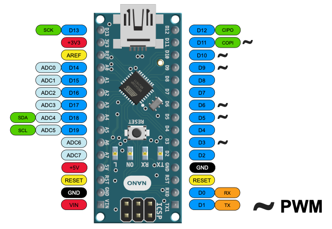
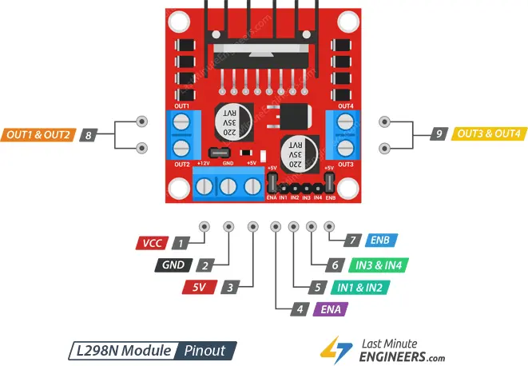
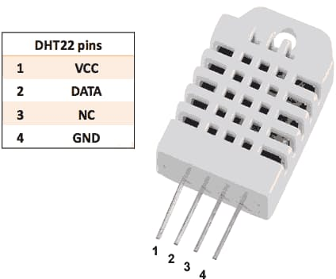
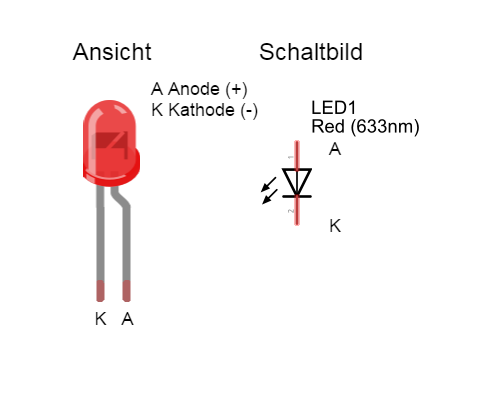
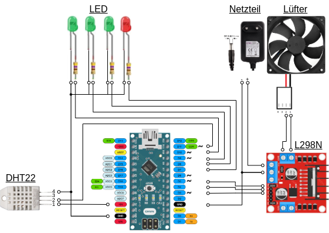

# HumidityGuard
Trockenbox-Lüfterregelung für Pflanzenzuschnitt mit DHT22 und Arduino Nano

## Übersicht
Dieses Projekt implementiert eine Trockenbox-Regelung für die Luftfeuchtigkeit, um den Feuchtigkeitsgehalt in einem Karton mit Pflanzenzuschnitt zu steuern. Es nutzt einen DHT22-Feuchtigkeitssensor (AM2302) zur Messung der Luftfeuchtigkeit und Temperatur und steuert einen 12V Lüfter basierend auf den gemessenen Werten. Es gibt auch eine LED-Anzeige für verschiedene Feuchtigkeits-Schwellenwerte und eine Fehler-LED zur Diagnose von Problemen mit dem Sensor oder dem Lüfter.

## Anpassung für andere Feuchtigkeitswerte
Die Ziel-Feuchtigkeit und die Schwellenwerte für den Lüfter können einfach durch Anpassung der ControlSettings und LEDControlSettings Strukturen geändert werden.

	ControlSettings settings(2.0, 0.1, 1.0, 60.0, 65.0, 55.0);  // Beispiel: Kp = 2.0, Ki = 0.1 , Kd = 1.0, Ziel-Feuchtigkeit = 60%, ThresholdOn = 65% , ThresholdOff = 55%
	LEDControlSettings setLED(55.0, 60.0, 65.0); // Beispiel: Schwellenwert LED 1 = 55.0, Schwellenwert LED 2 = 60.0, Schwellenwert LED 3 = 65.0

## Features:
    * PID-basierte Lüftersteuerung: Der Lüfter wird durch eine PID-Regelung basierend auf der aktuellen Luftfeuchtigkeit gesteuert.
    * Fehlerbehandlung: Das System versucht, bei einem Sensorfehler oder Lüfterfehler mehrere Versuche zur Fehlerbehebung zu unternehmen, bevor es in den Wartungsmodus geht.
    * Betriebsmodi: Über ein Status-LED wird der Systemzustand angezeigt, und es gibt eine automatische Wiederherstellung bei Fehlern.
    * LED-Anzeige: Drei LEDs zeigen an, ob die Feuchtigkeit in bestimmten Bereichen liegt.
    * Nicht-blockierende Verzögerungen: Anstatt delay() zu verwenden, wird millis() zur Zeitmessung verwendet, sodass das System weiterhin reagieren kann.

## Hardware-Anforderungen
    * Arduino Nano oder ein ähnliches Arduino-kompatibles Board
    * DHT22 Sensor (AM2302) für die Messung von Temperatur und Luftfeuchtigkeit
    * 12V 2-Pin Lüfter für die Belüftung
    * Motorbrücke (z.B. L298N) zur Steuerung des Lüfters
    * 4 LEDs für Statusanzeigen (Fehler und Schwellenwerte)
    * Widerstände (für LEDs, falls nötig)
    * Wires and Breadboard für das Testen der Schaltung
    * Externes Netzteil für die Motorbrücke, kompatibel zu den Lüfter (z.B. 12V, 2.0A, 24W)

### Pinouts:
#### arduino_nano
 

#### L298N_motor_driver
 

#### DHT22_temperature_humidity_sensor
 

#### LED_pinout
 

#### HumidityGuard_scheme
 

## Code-Konfiguration

  ### 1. Schaltplan, Sensoren und Aktoren konfigurieren 
  
    DHT22:
      * VCC -> Arduino 5V
      * GND -> Arduino GND
      * DATA -> Arduino Pin 11
        
    Motorbrücke
      * VCC -> Netzteil 12V 
      * GND -> Netzteil GND
      * GND -> Arduino GND
      * ENA -> Arduino Pin 5 FAN 1 
      * IN1 -> Arduino Pin 4 FAN Aus
      * IN2 -> Arduino Pin 3 FAN An
      * Out1-> Fan GND
      * Out2-> Fan IN / VCC
    
    Lüfter:
      * Steuerung des 12V Lüfters über eine Motorbrücke (L298N oder ähnliche) mit den Pins FAN1, LUEFTER_EIN, LUEFTER_AUS
      * VCC -> 12V
      * GND -> GND
    	
    LEDs:
      * LED 1 -> Arduino Pin 10 erster Schwellenwert
      * LED 2 -> Arduino Pin 9 zweiter Schwellenwert
      * LED 3 -> Arduino Pin 8 dritter Schwellenwert
      * Fehler-LED -> Pin 7
      * GND -> Arduino GND

### 2. PID-Regelung und Schwellenwerte
Die PID-Regelung mit den Parameter (Kp, Ki, Kd) für den Lüfter ist so konzipiert, dass die Luftfeuchtigkeit durch den Lüfter geregelt wird, um den Zielwert zu erreichen.

    ControlSettings settings(Kp, Ki, Kd, baseHumidity, ThresholdOn, ThresholdOff);
      * Kp, Ki, Kd: PID-Regelungskonstanten für die Luftfeuchtigkeit
      * baseHumidity: Der Zielwert der Luftfeuchtigkeit
   	  * ThresholdOn, ThresholdOff: Schwellenwerte für das Ein- und Ausschalten des Lüfters

### 3. Fehlerbehandlung und Wiederholungsmechanismus
Im Code ist ein Fehlermechanismus implementiert, der den Sensor mehrmals liest, wenn ein Fehler auftritt. Die maximale Anzahl an Versuchen ist durch maxRetries festgelegt. Wenn nach mehreren Versuchen der Sensor immer noch nicht richtig liest, geht das System in den Wartungsmodus.

	* const int maxRetries = 3; // Maximalanzahl an Versuchen beim Lesen des Sensors

### 4. Anpassung der LED-Schwellenwerte
Die LED-Schwellenwerte für die Feuchtigkeit können im Konstruktor von LEDControlSettings eingestellt werden. Diese Werte bestimmen, bei welchem Feuchtigkeitsniveau die jeweilige LED leuchtet.

	LEDControlSettings setLED(led1, led2, led3); 
 
### 5. Gleitender Durchschnitt
Die Berechnung des gleitenden Durchschnitts sorgt dafür, dass einzelne Messabweichungen nicht sofort die Lüftersteuerung beeinflussen. Der Standardwert ist auf 10 Messungen gesetzt, aber auch dieser kann angepasst werden.

	float calculateMovingAverage(float newHumidity) {
	  static const int numReadings = 10; // Anzahl der Messungen für den gleitenden Durchschnitt
	  ...
	}

## Erweiterungsmöglichkeiten
    * EEPROM-Speicherung: Du kannst die aktuellen Feuchtigkeitswerte oder PID-Parameter im EEPROM speichern, um sie nach einem Neustart wiederherzustellen.
    * Lüfterregelung via PWM: Wenn du den Lüfter nicht nur ein- und ausschalten, sondern auch die Geschwindigkeit steuern möchtest, kannst du PWM (Pulsweitenmodulation) verwenden.
    * Fehler- u.o Messwertprotokollierung: Der Code könnte so erweitert werden, dass Protokolle in einer Datei gespeichert werden.
